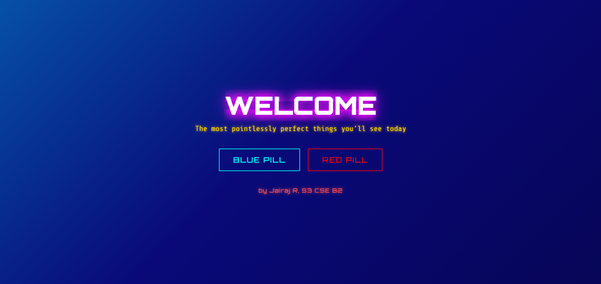
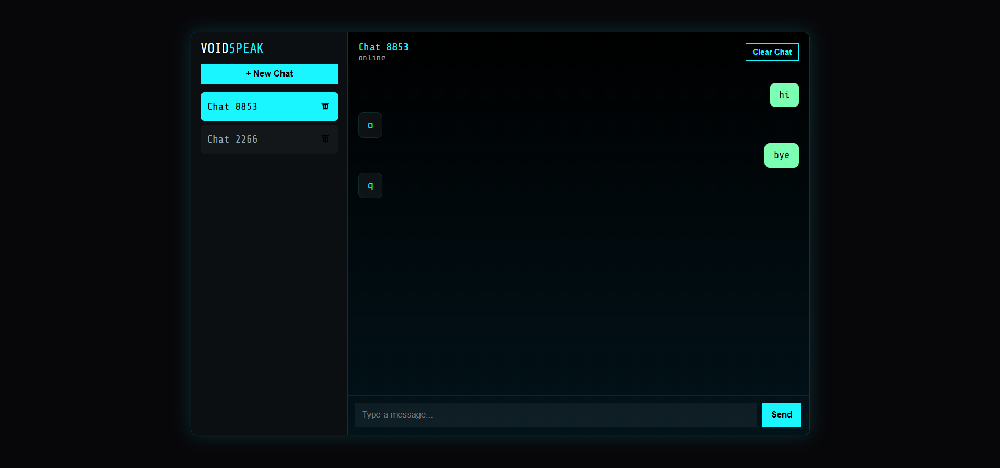
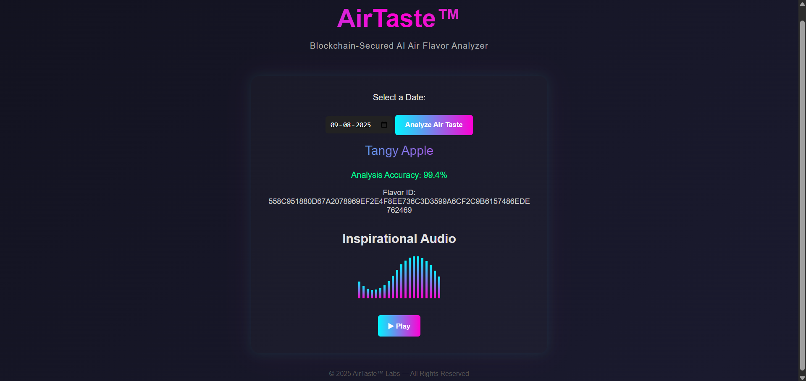
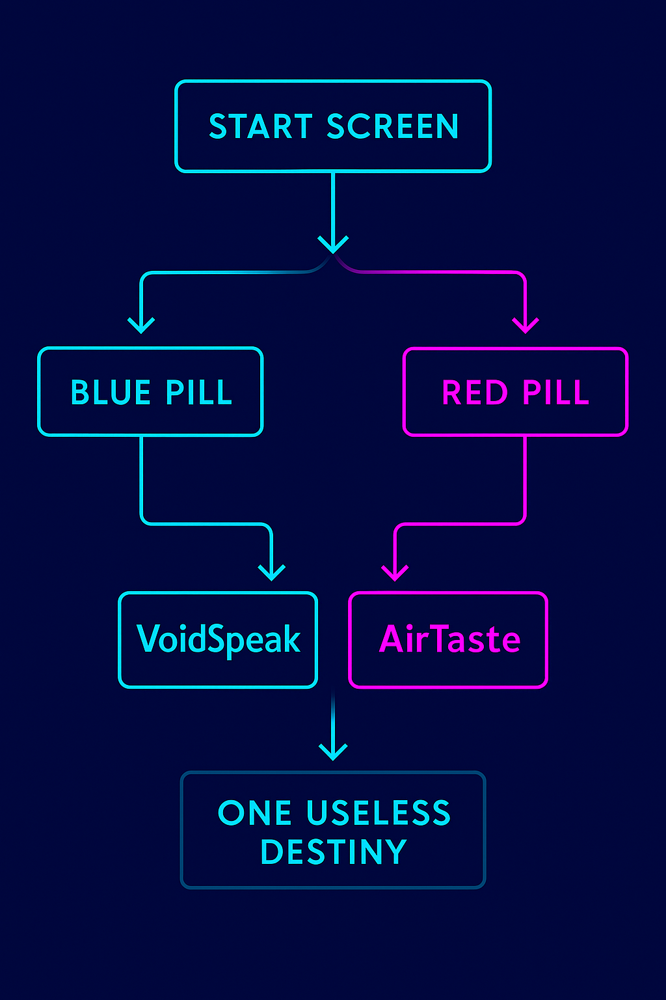

# PILL VECTOR 🎯

## Basic Details
### Team Name: JR_P1LL_V3CTOR

### Team Members
- Team Lead: Jairaj R - College of Engineering Trivandrum

### Project Description
Pill Paradox presents two pills. Choose the blue pill to enter VoidSpeak, where every input returns only a single random character. Choose the red pill to experience AirTaste, which gives the tase of air of the chosen day. Two choices. Two worlds. One useless destiny.

### The Problem (that doesn't exist)
AirTaste — Nobody was losing sleep over what flavor the air “tastes like” on a random date, but clearly, humanity needed a way to know (and even score its accuracy).
VoidSpeak — People talk too much sense sometimes, so obviously, we needed a chat app where the bot replies with meaningless keyboard noise.
Both worlds answer the same non-question: “How can we make technology spectacularly unhelpful, but in style?”

### The Solution (that nobody asked for)
AirTaste — A date-based, AI-powered air flavor generator complete with an “accuracy” rating, for those who demand absurd precision in nonsense.
VoidSpeak — A neon cyberpunk multi-chat where bots only respond with random characters, delivering a premium, high-aesthetic dose of gibberish.
Together, they form the Pill Paradox: two different, equally useless realities that you choose between — one flavored, one meaningless — and neither making the world better in any measurable way.

## Technical Details
### Technologies/Components Used
For Software:
- HTML, CSS, JavaScript
- VS Code
- GitHub, Vercel

For Hardware: NONE

### Implementation
For Software:
# Installation
git clone https://github.com/jairajrenjith/UselessProjects2.0-FrontPage.git

cd UselessProjects2.0-FrontPage

# Run
npx live-server

### Project Documentation
For Software:

# Screenshots

*A concept page about choosing between two pills (red and blue), each leading to different fictional “worlds” with no real outcome.*

*A cyberpunk-style multi-chat interface where the AI replies with random keyboard characters, simulating meaningless conversations.*

*A web app that lets users imagine tasting different flavors through the air, simulating a pointless but fun sensory experience.*

# Diagrams

*A simple decision-based workflow where the user starts at a main screen, chooses between two options—"Blue Pill" leading to VoidSpeak or "Red Pill" leading to AirTaste—both ultimately converging to the same final outcome.*

### Project Demo
# Video
https://drive.google.com/file/d/1osgnN27a9owS4hi-BuIQzDxpZahCksRA/view

*In this demo, you enter the Pill Paradox and choose between two worlds. Picking the red pill opens VoidSpeak, a chat where the bot responds with nothing but a single random character — turning silence into its own strange language. Choosing the blue pill opens AirTaste, where every response is a burst of light, airy randomness, like tasting words without meaning. Two choices, two worlds — both equally absurd, gives useless results.*

# Additional Demos
https://voidspeak.vercel.app/ - VoidSpeak (Blue Pill)

https://airtaste.vercel.app/ - AirTaste (Red Pill)

## Team Contributions
- Jairaj R: Did the entire project.

---
Made with ❤️ at TinkerHub Useless Projects 

